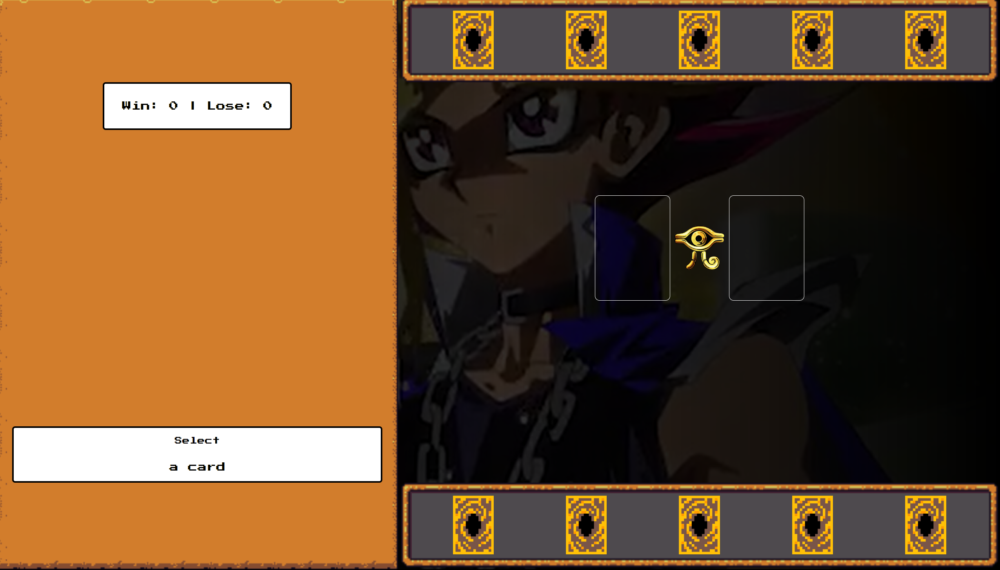

# Jokenpo JSGame - Yu-Gi-Oh

In this game developed with web technologies listed below, it was used an RPG style and a Yu-Gi-Oh theme.

## Technologies

- HTML
- CSS
- JavaScript

## How to play

Choose any of the 5 cards from the bottom selector. You can just hover over the card to check what is its type (rock, paper or scissors) and then click on it.

You can check your score and the machine's score on the top left.

Good luck! 😁

[**Click Here to Play**](https://eveegomes.github.io/yugioh-jokenpo-jsgame/) 🕹️

## Credits

This game is part of a bootcamp from [DIO](https://www.dio.me/en) and was developed during a lesson of [Felipe Aguiar](https://github.com/felipeAguiarCode).
